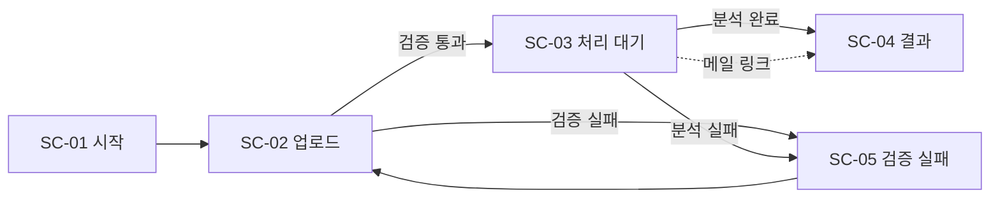

# 화면 명세 (screen_spec)

흐름도 기준으로 **사용자가 직접 보는 화면 5개**만 추린 명세.
흐름도에 없는 기능은 [제외 목록](#흐름도에-없어-제외한-것)으로 내렸고,
흐름도가 답을 주지 않는 항목은 전부 `확인 필요`로 남겼다.

- 대상 사용자: 교통사고 손해사정사 · 법률 사무소 실무자
- 완료 기준: **외부인이 자기 영상을 올려 리포트를 받는 흐름이 끊김 없이 동작**

## 화면 흐름

흐름도의 `영상 검증` 노드가 분기점이고, `속도 추정 모델 실행`부터 `근거 프레임 추출`까지는
사용자가 보지 않는 서버 구간이라 화면이 아니라 **SC-03의 상태**로만 드러난다.

---

## SC-01 시작

| 항목 | 내용 |
|---|---|
| **목적** | 방문자를 업로드로 보낸다. 이 화면은 이 일만 한다. |
| **입력값** | 없음 |
| **표시 정보** | 한 줄 서비스 설명 / 지원 사양(포맷·용량·길이) — 흐름도 `영상 검증` 조건을 미리 노출 |
| **핵심 버튼** | `영상 올리기` → SC-02 |
| **필요 상태** | 단일 상태 |
| **다음 화면** | SC-02 |

`확인 필요`
- 실제 분석 리포트 샘플을 이 화면에 걸 것인가 (흐름도에 없음. 다만 실무자 신뢰 확보 수단으로 후보)
- 정확도 표기 문구 — `오차 5km/h 수준이 실무에서 통용되는가`의 답이 나와야 문장이 정해진다
- 영상 보관·삭제 정책 문구 — `영상 보관·삭제 정책은 어떻게 잡는가` 확정 전까지 작성 불가

---

## SC-02 업로드

흐름도 `입력` 묶음(블랙박스 영상 / 사용 용도 / 수신 이메일)을 그대로 받는 화면.

| 항목 | 내용 |
|---|---|
| **목적** | 분석에 필요한 세 가지 입력을 한 번에 받고, 서버로 보내기 전에 걸러낼 것을 걸러낸다. |
| **입력값** | ① 블랙박스 영상 (필수) ② 사용 용도 (필수, 단일 선택) ③ 수신 이메일 (필수) |
| **표시 정보** | 지원 포맷 · 최대 용량 · 최대 길이를 **업로드 전에** 표시 / 항목별 인라인 오류 / 선택한 파일의 길이·용량 |
| **핵심 버튼** | `분석 시작` → 검증 통과 시 SC-03, 실패 시 SC-05 |
| **필요 상태** | 초기 / 파일 선택됨 / 클라이언트 검증 실패 / 전송 중(버튼 잠금) / 전송 완료 |
| **다음 화면** | SC-03 (통과) · SC-05 (실패) |

검증은 흐름도의 `영상 검증 포맷·용량·길이` 노드와 같은 조건을 **클라이언트에서 1차, 서버에서 재차** 본다.
클라이언트 검증은 이탈을 줄이려는 것이고 판정 권한은 서버에 있다.

`확인 필요`
- 사용 용도 선택지 목록 — 흐름도는 `사용 용도`라고만 적혀 있고 값이 정의돼 있지 않음
- 지원 포맷·용량·길이의 구체적 수치 — `지원 가능한 블랙박스 기종 범위는 어디까지인가`의 답에 종속
- 정책 동의 체크박스를 둘 것인가 — `영상 보관·삭제 정책` 확정 전까지 동의받을 문안 자체가 없음

---

## SC-03 처리 대기

흐름도에서 `속도 추정 모델 실행 → 구간별 속도 산출 / 감속 구간 탐지 / 오차 범위 산출 / 근거 프레임 추출`이
도는 동안 사용자가 보는 유일한 화면. **완료 기준의 "끊김 없이"가 걸린 화면이다.**

| 항목 | 내용 |
|---|---|
| **목적** | 접수됐음을 알리고, 창을 닫아도 결과를 받는다는 것을 알린다. |
| **입력값** | 없음 (SC-02에서 발급된 결과 주소로 진입) |
| **표시 정보** | 3단계 진행 표시(업로드 완료 → 분석 중 → 리포트 생성) / 결과를 받을 이메일 주소 / 접수한 파일명 |
| **핵심 버튼** | 없음 (자동 전환) |
| **필요 상태** | 대기 중 / 분석 중 / 완료(→SC-04 자동 이동) / 실패(→SC-05) |
| **다음 화면** | SC-04 (완료) · SC-05 (실패) |

- **남은 시간은 표시하지 않는다.** 예측이 틀리면 그 자체로 신뢰를 잃는다.
- 완료 시 이 화면과 메일 두 경로 모두 SC-04로 이어진다. 둘 중 하나만 있어도 흐름이 끊기지 않아야 한다.

`확인 필요`
- 결과 주소의 접근 방식 — 로그인 없이 링크만으로 열 것인지, 만료를 둘 것인지
- 완료·실패 메일의 문안

---

## SC-04 결과 ★

흐름도 `출력` 묶음(속도 그래프 / 오차 범위 / PDF 리포트 / 근거 프레임)이 모이는 화면.

| 항목 | 내용 |
|---|---|
| **목적** | 추정 결과를 확인시키고 **PDF 리포트를 받아 가게 한다.** |
| **입력값** | 없음 |
| **표시 정보** | ① 시간축 속도 그래프 + **오차 범위 음영** ② 구간별 속도 ③ 감속 구간 ④ 근거 프레임 + 타임스탬프 ⑤ 분석 대상(파일명·분석 일시) |
| **핵심 버튼** | `PDF 리포트 내려받기` |
| **필요 상태** | 정상 / 감속 구간 없음 / 근거 프레임 추출 실패 |
| **다음 화면** | 없음 (종착 화면) |

- 그래프는 **선 하나만 그리지 않는다.** 오차 범위 음영은 이 화면과 PDF 양쪽에서 제거하지 않는다.
- 감속 구간은 절대 속도와 같은 층위로 배치한다. 감속은 두 시점의 차이값이라 절대 오차의 영향을 덜 받는다.
- PDF는 화면과 같은 6가지(그래프 / 구간별 속도 / 오차 범위 / 근거 프레임 / 분석 대상 / 고지)를 담는다.

`확인 필요`
- 결과를 어느 수준까지 낼 것인가 — `제출 자료로 쓰는가 내부 판단용인가`의 답에 따라 리포트 형식이 달라진다
- 오차 표기 방식 (평균만 / p95 / 최대) — 측정 전에는 숫자를 적지 않는다
- 감속 구간 탐지 임계값
- `정식 감정의 비용·기간 기준선`을 이 화면에서 비교로 보여줄 것인가

> **고지 문구는 흐름도에 없지만 남긴다.** `제출 자료로 쓰는가`와 `정식 감정의 비용·기간 기준선`이
> 미해결인 상태에서 이 화면은 감정 결과로 오인될 수 있다. 삭제 규칙보다 이 위험이 앞선다고 보고 유지했다.
> 흐름도 기준으로 빼야 한다면 별도로 알려 달라.

---

## SC-05 검증·분석 실패

흐름도 `영상 검증` 노드의 실패 출구, 그리고 `속도 추정 모델 실행`이 실패했을 때의 출구.

| 항목 | 내용 |
|---|---|
| **목적** | 왜 안 됐는지와 무엇을 하면 되는지를 알려 다시 시도하게 한다. |
| **입력값** | 없음 |
| **표시 정보** | 실패 사유(포맷 / 용량 초과 / 길이 초과 / 파일 손상 / 분석 실패를 **구분해서**) / 사유별 해결 경로 |
| **핵심 버튼** | `다시 올리기` → SC-02 |
| **필요 상태** | 사유별 5종 (포맷·용량·길이·손상·분석 실패) |
| **다음 화면** | SC-02 |

"오류가 발생했습니다"는 재시도를 막는다. 사유는 반드시 구분해서 낸다.

`확인 필요`
- 미지원 기종 정보를 이 화면에서 수집할 것인가 — `지원 가능한 블랙박스 기종 범위는 어디까지인가`를
  풀 데이터가 여기서 나오지만, 흐름도에는 수집 단계가 없다
- 분석 실패 시 자동 재시도 횟수

---

## 흐름도에 없어 제외한 것

아래는 흐름도에 노드가 없어 이 명세에서 뺐다. **현재 구현에는 들어가 있으므로**, 빼려면 코드에서도 걷어내야 한다.

| 제외 항목 | 현재 구현 위치 | 흐름도와의 관계 |
|---|---|---|
| 정확도 피드백 ("이 결과가 정확한가요?") | SC-04 하단 | 노드 없음 |
| 전문가 검토 신청 (fake door) | SC-04 모달 | `건당 지불 의사 금액은 얼마인가`는 **질문**이지 기능 노드가 아님 |
| 미지원 기종 수집 폼 | SC-05 하단 | `지원 가능한 기종 범위`도 마찬가지로 질문 노드 |
| 영상 SHA-256 해시 표기 | SC-04 · PDF | 노드 없음. `제출 자료로 쓰는가`가 "그렇다"로 정해지면 되살릴 후보 |
| 랜딩 샘플 리포트 | SC-01 | 노드 없음 |
| 정책 동의 체크박스 | SC-02 | 노드 없음. 보관·삭제 정책 확정과 함께 결정 |

## 확인 필요 (흐름도에서 그대로 옮김)

| 질문 | 걸려 있는 화면 |
|---|---|
| 제출 자료로 쓰는가, 내부 판단용인가 | SC-04 (리포트 형식·수준 전체) |
| 오차 5km/h 수준이 실무에서 통용되는가 | SC-01 (정확도 문구), SC-04 (오차 표기) |
| 건당 지불 의사 금액은 얼마인가 | 화면 없음 — 결제 흐름 자체가 미정 |
| 지원 가능한 블랙박스 기종 범위는 어디까지인가 | SC-02 (제약 수치), SC-05 (사유 분류) |
| 영상 보관·삭제 정책은 어떻게 잡는가 | SC-01·SC-02 (정책 문구), SC-03 (결과 링크 만료) |
| 정식 감정의 비용·기간 기준선은 | SC-04 (비교 표기 여부) |
